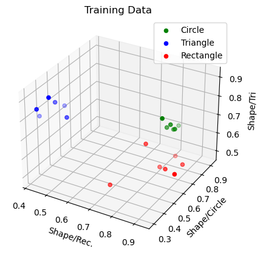

# 🧠 Machine Learning Hand Drawn Polygon Classifier

This is a machine learning model that can classify hand-drawn polygons into different categories, based on their shape features. The model then uses three different classification algorithms, which are trained and tested on a dataset of labeled polygons.

## 🎨 Dataset

The dataset consists of hand-drawn polygons, which were labeled into three different categories: hand-drawn rectangle, circle, and triangle. Each polygon was represented by a set of points that define its contour.

## 🧮 Feature Extraction

The feature extraction process involves computing the convex hull of each polygon, and then comparing this convex hull with the minimum enclosing circle, rectangle and triangle that bound the polygon. The resulting features are a set of ratios that describe the shape of the polygon, such as the ratio of the convex hull area to the bounding circle area.

## 🤖 Classification Algorithms

The model uses four different classification algorithms - implemented from scratch - to predict the category of unseen polygons:

- **Minimum Distance Classifier**: this algorithm assigns each polygon to the category with the closest average shape features in the training set.
- **Nearest Neighbour Classifier**: this algorithm assigns each polygon to the category of the closest polygon in the training set, based on the shape features.
- **K-Nearest Neighbour Classifier**: this algorithm assigns each polygon to the category that is most frequent among the K closest polygons in the training set, based on the shape features.
- **Bayesian Classifier**: this algorithm uses Bayes theorem to predict the classification by calculating the probability of each category given the observed shape features and selects the category with the highest probability as the predicted category assuming that the shape features are independent and normally distributed within each category. 

## 📈 Model Evaluation

The model has been evaluated on a test set of polygons, which were not used during training. The accuracy of each algorithm was measured as the percentage of correctly classified polygons.

## 🚀 Getting Started

To use this model, you can clone this repository and install the required dependencies. Then, you can run the `classify_polygons.py` script to classify your own hand-drawn polygons.

## 📚 Dependencies

This project requires the following dependencies:

- Python 3.x
- NumPy
- OpenCV2
- Matplotlib

## 📝 Conclusion

This project demonstrates the power of machine learning in classifying hand-drawn polygons. The use of different classification algorithms and feature extraction techniques can lead to better accuracy and performance.

The source code for the classifier is available on for those who want to contribute or modify the model!
